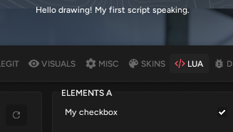

# Adding UI

Now that you know the basics, let’s extend our script by allowing the user to toggle the text. We can do this by adding a control to the menu.

### Creating a control <a href="#creating-a-control" id="creating-a-control"></a>

Let’s start by creating a simple checkbox:

```
local cb = gui.checkbox(gui.control_id('my_checkbox'));
```

Each control has a unique ID, which the UI framework uses to distinguish controls within containers. It’s very important that your control’s ID doesn’t conflict with others, as that could result in a broken state or worse.

To create the ID, call [`gui.control_id`](https://lua.fatality.win/control-id.html#call) and pass the desired ID.

Then, create the checkbox by calling [`gui.checkbox`](https://lua.fatality.win/checkbox.html#call) and passing the ID structure you've created.

### Constructing the row <a href="#constructing-the-row" id="constructing-the-row"></a>

UBy default, controls are typically placed in rows - layouts that stack elements in a specific manner. We provide a simple helper function - [`gui.make_control`](https://lua.fatality.win/gui.html#make-control).

```
local row = gui.make_control('My checkbox', cb);
```

### Adding the row to a group <a href="#adding-the-row-to-a-group" id="adding-the-row-to-a-group"></a>

With the control and row ready, let’s add them to a group.

> ####
>
> To view group and control IDs, you can enable Debug mode in the SCRIPTS tab.

In this example, we'll use the `lua>elements a` group. First, locate that group in the global context:

```
local group = gui.ctx:find('lua>elements a');
```

Then call its [`add`](https://lua.fatality.win/container.html#add) method to include your row:

```
group:add(row);
```

That's it!

### Using the value <a href="#using-the-value" id="using-the-value"></a>

Next, let’s modify our previous script so the text only appears if the checkbox is checked. Wrap your drawing code in an `if` statement before rendering the text:

```
if cb:get_value():get() then
```

and close it after.

The final script should look something like this:

```
local cb = gui.checkbox(gui.control_id('my_checkbox'));
local row = gui.make_control('My checkbox', cb);
local group = gui.ctx:find('lua>elements a');
group:add(row);

local function on_present_queue()
    if cb:get_value():get() then
        local d = draw.surface;
        d.font = draw.fonts['gui_main'];
        d:add_text(draw.vec2(50, 50),
            'Hello drawing! My first script speaking.',
            draw.color.white()
        );
    end
end

events.present_queue:add(on_present_queue);
```

And here's the result:

<figure><figcaption></figcaption></figure>
