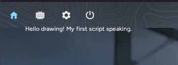

# First Steps

Now that you’ve covered the essentials, it’s time to start scripting.

### Fire up a text editor <a href="#fire-up-a-text-editor" id="fire-up-a-text-editor"></a>

Feel free to use any text editor you prefer: [Visual Studio Code](https://code.visualstudio.com/), [Notepad++](https://notepad-plus-plus.org/downloads/), or even a simple Notepad.

Local scripts are located here: `<CS2_Directory>/game/csgo/fatality/scripts`. You may notice there's also a `lib` directory, but we’ll get to that later.

Create a new file ending with `.lua`, and begin your work on the script.

> ####
>
> `.ljbc` format cannot be loaded from local sources.

### Writing your first script <a href="#writing-your-first-script" id="writing-your-first-script"></a>

A typical “Hello world!” example can be a bit trivial, so let’s try something slightly more advanced instead.

```
local function on_present_queue()
    local d = draw.surface;
    d.font = draw.fonts['gui_main'];
    d:add_text(draw.vec2(50, 50),
        'Hello drawing! My first script speaking.',
         draw.color.white()
    );
end

events.present_queue:add(on_present_queue);
```

Now, let's break down this example script:

#### Defining a callback function <a href="#defining-a-callback-function" id="defining-a-callback-function"></a>

Most of your scripting will run within [several callbacks](https://lua.fatality.win/events.html) we provide. Each event has its own signature, so pay attention to the parameters your callback function should accept. `present_queue` doesn’t provide any parameters, so our function doesn’t need any either.

```
local function on_present_queue()
end
```

> ####
>
> Defining something `local` is optional, although recommended for clearer scope management.

#### Accessing drawing layer <a href="#accessing-drawing-layer" id="accessing-drawing-layer"></a>

With the callback function defined, let’s actually render something on the screen!

To do this, you first need to access the [drawing layer](https://lua.fatality.win/draw.html#surface). We provide a single drawing layer that’s safe to use within the game thread. Due to how the game functions internally, it’s strongly discouraged to call game functions in other threads. Luckily all of our events run in the game thread.

This setup allows you not only to draw but also to query information on player health or other entities.

To access the layer, simply reference the `surface` field in the `draw` table:

```
local d = draw.surface;
```

> ####
>
> You don't have to store it in a variable, but it would be nicer if you don't have to type out `draw.surface` every time, right?

#### Setting a font <a href="#setting-a-font" id="setting-a-font"></a>

After retrieving the layer, you must set a font object before drawing any text on the screen. This is purely for performance reasons, so you don’t have to pass a heavy font object every time you draw text.

All fonts are stored in [`draw.fonts`](https://lua.fatality.win/draw.html#fonts). To access a font, either use dot syntax, or treat it like a dictionary:

```
d.font = draw.fonts['gui_main'];
```

#### Drawing text <a href="#drawing-text" id="drawing-text"></a>

With the font set, it’s time to draw some text.

Invoke the [`add_text`](https://lua.fatality.win/layer.html#add-text) method on the layer. Notice that it’s called using the colon syntax: `obj:fn()`, because it’s a method.

> ####
>
> You can also invoke methods with a dot syntax, as long as you provide the object in the first argument. Both calls: `obj:fn()` and `obj.fn(obj)` are identical.

```
d:add_text(draw.vec2(50, 50),
        'Hello drawing! My first script speaking brev.',
         draw.color.white()
    );
```

#### Registering a callback <a href="#registering-a-callback" id="registering-a-callback"></a>

Now that you’ve created your first callback, you need to register it so Fatality knows to invoke it. This is done by calling the [`add`](https://lua.fatality.win/event-t.html#add) method on [`events.present_queue`](https://lua.fatality.win/events.html#present-queue).

```
events.present_queue:add(on_present_queue);
```

#### Result <a href="#result" id="result"></a>

That's it! If you've done everything correctly, you should see something like this:

<figure><figcaption></figcaption></figure>
